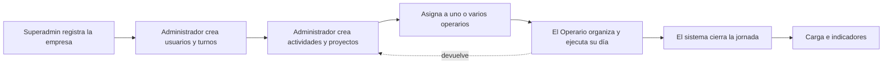
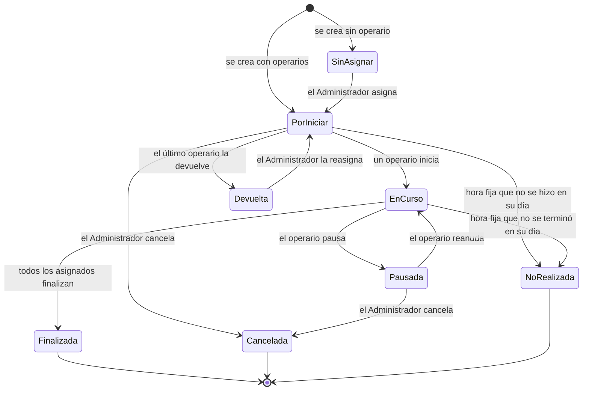

# GestLab — Lógica de negocio

Este documento explica **cómo funciona GestLab**: qué hace cada usuario, qué le pasa a una actividad desde que se crea hasta que se cierra, y qué decide el sistema por su cuenta. No habla de código.

- Las reglas oficiales están en el [documento de alcance](alcance_proyecto.md). Si algo de aquí no coincide con el alcance, manda el alcance, y este documento se corrige.
- Los términos se usan como los define el glosario (Sección 14 del alcance).
- Lo que ya funciona y lo que falta está en [avance.md](avance.md). Aquí se marca con **(pendiente)** lo que todavía no está construido.

---

## 1. Para qué sirve

GestLab ayuda a una empresa a organizar el trabajo de sus operarios y a medir cuánto trabajo tiene cada uno. Responde tres preguntas:

1. **Qué se debe hacer:** las actividades, con su prioridad, su fecha y su tiempo estimado.
2. **Quién lo está haciendo:** a quién se asignó cada actividad y en qué va.
3. **Cuánto trabajo hay:** la carga de cada operario en su jornada y si la supera.

Varias empresas usan el mismo sistema, pero cada una ve solo sus datos.

---

## 2. Quiénes lo usan

| Rol | Qué hace |
|---|---|
| **Superadmin** | Registra las empresas, define cuántos Administradores y Operarios puede tener cada una, carga su logo y crea su primer Administrador. No ve el trabajo diario de las empresas |
| **Administrador** | Organiza el trabajo de su empresa: crea Operarios y otros Administradores (dentro del límite), crea actividades y proyectos, las asigna, define los turnos, revisa la carga y valida la asistencia |
| **Operario** | Ejecuta su trabajo: ve su día, inicia, pausa y finaliza actividades, devuelve las que no puede hacer y marca su entrada y su salida |

Los usuarios de una empresa ven el logo y el nombre de su empresa en lugar de la marca GestLab (marca blanca).

---

## 3. El recorrido completo

1. El **Superadmin** registra la empresa con sus límites de usuarios y crea su Administrador.
2. El **Administrador** crea a los Operarios y los turnos, y le asigna un turno a cada Operario.
3. El Administrador crea **actividades**: independientes o agrupadas en un **proyecto**.
4. Las **asigna** a uno o varios operarios. Al asignar, el sistema le muestra la carga de cada operario y le avisa si alguno queda por encima de su capacidad, pero no se lo impide.
5. El **Operario** ve su día ordenado, marca su entrada, ejecuta sus actividades y marca su salida.
6. Al terminar el día, el sistema **cierra la jornada**: lo que quedó pendiente se reprograma o queda como No realizado, según su tipo.
7. Con lo registrado se calculan la **carga** y los **indicadores**.

---

## 4. La actividad

Una actividad es la unidad de trabajo. Tiene:

- **Código** consecutivo por empresa (por ejemplo, `OT-0042`), título, descripción y ubicación (línea, máquina o área).
- **Categoría:** Producción, Mantenimiento, Calidad, Limpieza o Logística.
- **Prioridad:** Baja, Media, Alta o Urgente. Urgente significa que debe interrumpir lo que el operario esté haciendo. El sistema ordena por un peso numérico de la prioridad, nunca comparando textos.
- **Tiempo estimado:** el de la actividad completa. Si la hacen tres operarios, cada uno la suma completa a su carga; no se divide.
- **Fecha programada:** la jornada a la que pertenece. No puede ser un día que ya pasó.
- **Hora fija u horario flexible:**
  - *Hora fija:* el Administrador le pone una hora y esa hora no se mueve.
  - *Horario flexible:* queda asignada al día y el Operario decide en qué momento hacerla.
- **Proyecto** (opcional). Si no tiene, es una actividad independiente.
- **Información de la actividad (pendiente):** pasos, herramientas y materiales, equipo, adjuntos y contacto. Cuando tiene todo lo que se le pidió, aparece como "Lista para iniciar".

### Estados de una actividad

| Estado | Qué significa |
|---|---|
| Sin asignar | No tiene operario: nunca se asignó o la devolvieron. El Administrador las consulta aparte |
| Por iniciar | Tiene operarios y ninguno la ha empezado |
| En curso | Al menos un operario la está haciendo |
| Pausada | Nadie la está haciendo en este momento, pero alguien la empezó |
| Devuelta | El último operario asignado la devolvió; espera una decisión del Administrador |
| Finalizada | Todos los asignados la terminaron. Es definitivo |
| No realizada | Era de hora fija y no se terminó en su día. Es definitivo |
| Cancelada | El Administrador la anuló, con su motivo. Es definitivo |

Una actividad finalizada, no realizada o cancelada ya no se edita, no se reasigna y no se cancela. **Nada se borra:** lo que pasó queda en el historial.

### Varios operarios en una misma actividad

Cada operario tiene su propia **ejecución**: su hora de inicio, sus pausas y su hora de fin. La pausa de uno no pausa a los demás. Por eso:

- La actividad está "en curso" si al menos uno la está haciendo.
- Queda "finalizada" solo cuando todos los asignados la terminan. Mientras tanto se ve cuántos van ("1 de 2 finalizaron"), y al que ya terminó le aparece como hecha en su día.

---

## 5. Ejecutar el trabajo

### Las cuatro acciones del Operario

| Acción | Regla |
|---|---|
| **Iniciar** | Solo si la actividad le está asignada y no tiene otra en curso. Un operario tiene una sola actividad en curso a la vez; la base de datos lo garantiza aunque lleguen dos peticiones al mismo tiempo |
| **Pausar** | Exige un motivo. Una actividad de hora fija no se puede pausar una vez iniciada |
| **Reanudar** | Solo si no tiene otra en curso |
| **Finalizar** | Puede dejar una observación |

La hora de cada acción la pone el servidor, nunca el celular del operario.

### Motivos

- **Pausa:** la lista trae "Actividad urgente", "Actividad de hora fija", "Fin de jornada" y "Otro". Lo que alguien escribe en "Otro" queda guardado en la lista de su empresa.
- **Cancelación:** la lista empieza solo con "Otro" y se va llenando igual.
- **Devolución:** lista fija: Falta información, Me la asignaron por error, Falta herramienta o material, El equipo no está disponible, u Otro con texto.

### Urgentes y horas fijas

- Una actividad **urgente** interrumpe lo que el operario lleva: el operario pausa lo que hace y atiende la urgente. La excepción es una actividad de **hora fija** en curso, que no se interrumpe: el operario atiende la urgente al terminar, y mientras tanto el Administrador puede pasársela a otra persona.
- Cuando llega la hora de una actividad de hora fija, el operario pausa lo que lleva (motivo "Actividad de hora fija"), hace la fija y después retoma lo otro. El sistema avisa diez minutos antes **(pendiente)** y avisa si el orden elegido no alcanza a terminar antes de la hora fija **(pendiente)**.

### Devolver y cancelar

- **Devolver:** el Operario puede devolver una actividad solo antes de iniciarla, con su motivo. Si tenía compañeros, sale solo él; si era el único, la actividad queda "Devuelta" y el Administrador ve quién la devolvió y por qué.
- **Cancelar:** solo el Administrador, solo si nadie la tiene en curso, y con motivo. La cancelada sale de la carga pero sigue consultable.

---

## 6. La programación del día

**La estimación y la ejecución son cosas distintas.** El tiempo estimado sirve para planear; lo que se hizo se mide con sus horas reales de inicio y de fin.

El sistema calcula, para cada operario, la **programación del día**: la secuencia de sus actividades con la hora de inicio y de fin de cada una. Se recalcula cada vez que se consulta:

1. **Lo terminado** ocupa el tiempo que realmente tomó. Una actividad estimada en 2 horas que se hizo en 45 minutos ocupa 45 minutos.
2. **Lo que está en curso** va desde su inicio real hasta un **fin proyectado**: ahora más lo que le falta del estimado. Si ya se pasó del estimado, su fin proyectado es ahora.
3. **Las urgentes** van primero, desde ahora. Lo que estaba en curso se retoma después (salvo que sea de hora fija).
4. **Las de hora fija** van en su hora y no se mueven.
5. **Las de horario flexible** llenan el tiempo que queda, en el **orden del día** del operario. Una flexible entra antes de una fija solo si alcanza a terminar.

Consecuencia: **si algo termina antes, lo siguiente se adelanta; si se demora, se corre.**

### El orden del día

- El sistema sugiere un orden: primero la mayor prioridad, después la hora, y entre iguales la que lleva más días de retraso.
- El Operario puede cambiar el orden, pero solo de sus actividades de horario flexible. Las de hora fija y las urgentes no se reordenan; las urgentes van siempre arriba.
- El orden que elige vale para ese día. Lo que le asignen después se ubica al final, en el orden sugerido.

### El resumen de la jornada

- **Trabajado:** el tiempo real que ya trabajó (sin pausas).
- **Por hacer:** lo que falta (el estimado de lo que no ha empezado y lo que resta de lo empezado).
- **Disponible:** la capacidad de su jornada menos lo trabajado y menos lo que falta.

---

## 7. El cierre de jornada

Cuando termina el día (a la medianoche, en la zona horaria de la empresa), el sistema revisa lo que quedó abierto. No hay un proceso corriendo todo el tiempo: el cierre se hace la próxima vez que alguien de la empresa consulta o cambia algo, y está protegido para no hacerse dos veces.

| Situación | Qué hace el sistema |
|---|---|
| Actividad de **horario flexible** que no se hizo o no se terminó | **Reprogramación automática:** pasa al día siguiente, queda marcada como reprogramada y conserva su fecha original para contar los **días de retraso** |
| Actividad de **hora fija** que no se hizo o no se terminó | Queda **No realizada**. Es definitivo; si el trabajo sigue haciendo falta, el Administrador crea una nueva |
| Algo quedó **en curso** al terminar el día | Si es flexible, se pausa con el motivo "Fin de jornada" y se reprograma. Si es de hora fija, su ejecución se cierra y queda No realizada. En los dos casos la pausa o el cierre quedan con la hora de la medianoche, no con la de la consulta, para no inflar el tiempo real |

- Si una actividad tiene varios operarios, se reprograma para todos, porque tiene una sola fecha.
- Si el Administrador cambia a mano la fecha de una reprogramada, conserva su marca y su fecha original: el retraso ya ocurrió.
- Mientras no existan los turnos, la "siguiente jornada" es el día siguiente del calendario.

---

## 8. Turnos y asistencia

- Cada empresa define su **catálogo de turnos**: nombre, hora de inicio, hora de fin y tiempo de descanso. Un turno puede cruzar la medianoche; la jornada pertenece al día en que el turno empieza.
- Cada operario tiene **un solo turno** a la vez. Cuando se le cambia, se conserva la fecha del cambio, para que los periodos anteriores se calculen con el turno que regía entonces.
- La **capacidad** de la jornada es la duración del turno menos el descanso. Un operario sin turno tiene una capacidad provisional de 7 horas.
- El turno **no limita** el trabajo: el operario puede trabajar fuera de su turno, y ese tiempo cuenta como tiempo adicional.
- **Asistencia:** el operario marca su **entrada** y su **salida** de cada jornada; la hora la pone el servidor. El Administrador **valida** cada asistencia o la **corrige** con un motivo, y la corrección conserva las marcas originales.
- **Aviso de posible ausencia (pendiente):** si pasado un tiempo de tolerancia el operario no ha marcado entrada, el Administrador recibe un aviso con sus actividades del día para reasignarlas.

---

## 9. Carga, capacidad e indicadores

- **Carga:** la suma del tiempo **estimado** de las actividades de un operario en una jornada. Es un dato de planeación. Las canceladas no suman; las no realizadas sí, porque ocuparon su lugar en el día.
- **Sobrecarga:** cuando la carga supera el 100 % de la capacidad. Se avisa al asignar y en la carga del día; no se impide.
- **Avance de un proyecto:** horas estimadas de sus actividades finalizadas sobre las horas estimadas de todas (sin las canceladas).
- **Indicadores** (en construcción): cumplimiento de actividades (finalizada en su jornada), retraso (reprogramadas), incumplimiento (no realizadas), precisión de la estimación (estimado contra real), cumplimiento de jornada (tiempo en actividades sobre tiempo programado) y aprovechamiento (tiempo en actividades sobre tiempo presente).
- Regla para todos los indicadores agregados: **se suman los tiempos y se divide al final**; nunca se promedian porcentajes.

---

## 10. Reglas que atraviesan todo el sistema

- **La hora la pone el servidor.** Ninguna marca de tiempo viene del dispositivo del usuario.
- **Zona horaria por empresa.** Con ella se decide qué día es "hoy" y cuándo termina la jornada.
- **Nada se borra.** Las asignaciones se retiran o se devuelven, las actividades se cancelan con motivo, las correcciones conservan el dato original.
- **Cada empresa ve solo lo suyo.** Un Administrador solo ve y cambia datos de su empresa; un Operario solo ve sus actividades.
- **Límites de usuarios.** No se crea un usuario por encima del límite de su empresa, ni se baja un límite por debajo de los usuarios que ya tiene.
- **Seguridad de la sesión.** La sesión viaja en una cookie que otro sitio no puede usar, y el servidor rechaza cualquier cambio que no venga de la interfaz de GestLab.

---

## 11. Lo que el sistema no hace (por ahora)

- No asigna actividades solo: la asignación siempre la decide el Administrador. El sistema solo sugiere y avisa.
- No calcula horas extra ni su valor; el tiempo fuera del turno se muestra como dato.
- No envía notificaciones fuera de la aplicación (correo, mensajes); los avisos aparecen en pantalla.

Lo demás que queda fuera está en la Sección 9 del alcance.
